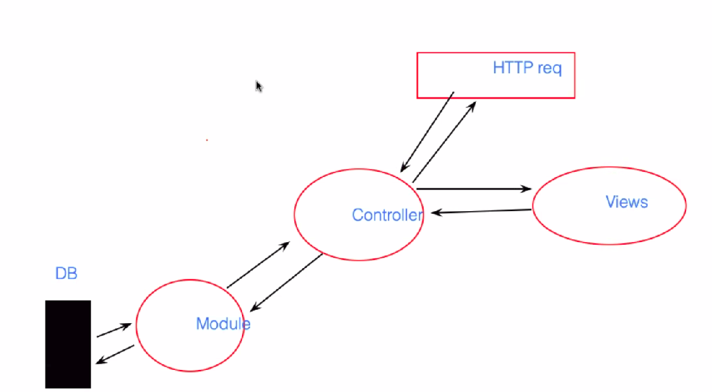

# Module view controller



## views

```javascript
res.redirect();
```

- log-in/ out
- when client tries to see something forbidden
- but it doestn have an message and we cant inform what happend to the client

### Tools

embadded js or handlebar

### EJS

like normal html, but one is allowed in vbetween the js code
EJS brackets
<%
grab value <%=

## Fake data app

form will trigger controller and the part of post in app
Nomral loop , with counter starting at 0
<%for(let i=0;i< data.length;i++){%>

In the faker you can choose region, language- and then it will rely on it and throw in this language
